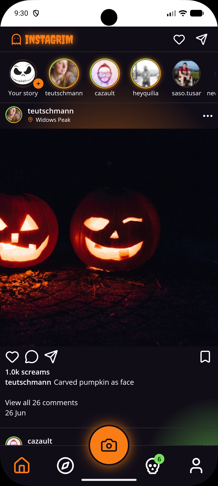
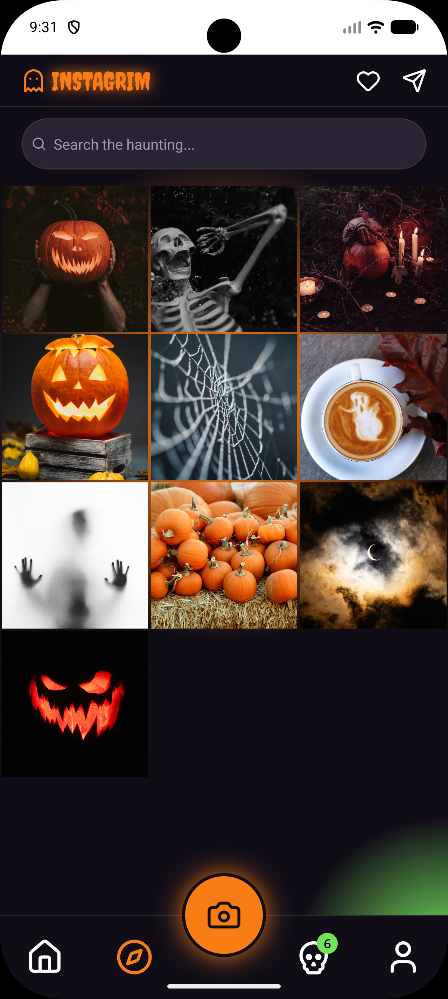
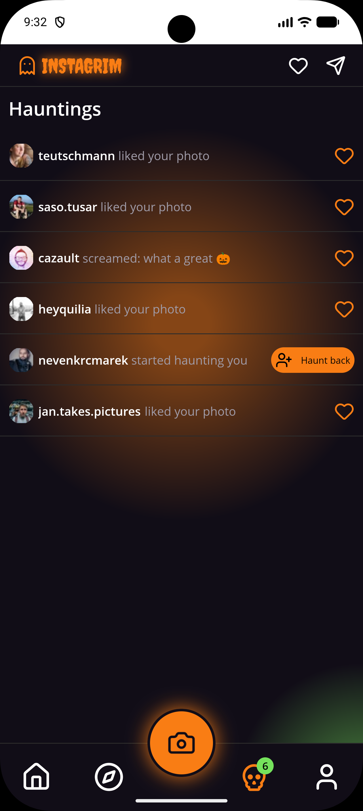

# instagrim

A Halloween themed social photos app created for [MAUI UI July 2026](https://goforgoldman.com/posts/mauiuijuly-26).

<table>
    <tr>
        <td></td>
        <td></td>
        <td></td>
    </tr>
</table>

## What is it?

instagrim is a demo app that utilises [Flagstone UI](https://github.com/matt-goldman/flagstone-ui). It uses the `FsEntry` control to create a rounded, bordered search bar, but the main purpose of the app is to show off the new `FsShell` feature.

## What is `FsShell`?

`FsShell` is a sub-classed, drop-in replacement for .NET MAUI's `Shell`. It decouples navigation and routing from presentation, fully preserving `Shell`'s existing navigation and routing semantics and functionality while giving you full control over visual presentation.

The example shown here is a straightforward tab bar, but it has two featurs you can't get out of the box in .NET MAUI:

* **Notification badge:** The 'Hauntings' page has a badge count showing the number of notifications (note this is mocked for this demo). This is not currently possible with `Shell` in .NET MAUI, but is trivial in Flagstone UI.
* **Action button:** The tab bar has a prominent camera button. Not shown in the screenshots, but fully working in the demo.

Both of these are ubiquitous UX requirements for mobile apps, and cannot be achieved in .NET MAUI apps without dropping out of the cross-platform layer to native code.

## How does `FsShell` work?

Simple - it's just a `ContentView`. You can make it look however you want, and Flagstone UI comes with an abstract base class that pre-wires everything you need to get started. You can also create your own from scratch, just implement the `IFsTabBar` interface to hook into the `Shell` navigation and routing functionality.

## Acknowledgements

* All images and user data come from [Unsplash](https://unsplash.com)
* Relies heavily on the [.NET MAUI Community Toolkit](https://github.com/communitytoolkit/maui) and [MVVM Community Toolkit](https://github.com/communitytoolkit/mvvm)

## Running the demo

1. Ensure you have all the .NET MAUI pre-requisites installed, see the [getting started](https://learn.microsoft.com/dotnet/maui/get-started/installation?view=net-maui-10.0&tabs=visual-studio) docs for guidance.
2. You will need to create a free Unsplash developer account and register an app (see [Unsplash developers](https://unsplash.com/developers))
3. In the `src/Resources/Raw/` directory, create a file called `ApiKey.txt`, and in here paste your _access key_ for your app (just as plain text, nothing else). The app is already set up to use it and the repo ignores it (unless you modify the `.gitignore` file).
4. Run the app